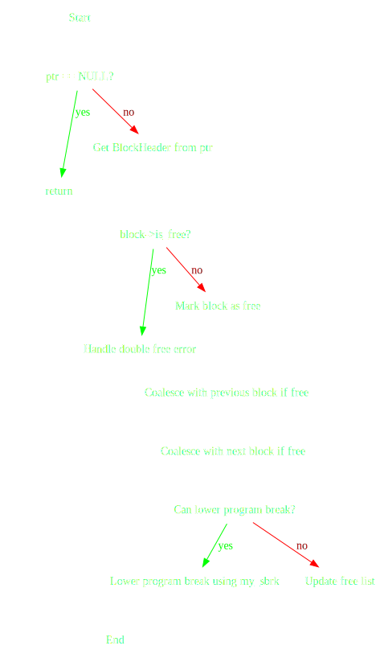

## Heap Memory Manager Simulation

This project is a simple simulation of a heap memory manager in C, designed to manage dynamic memory allocation, deallocation, and track the state of the heap. The project simulates the behavior of low-level memory management routines similar to `malloc`, `free`, and `sbrk` using a **best-fit** algorithm to manage free memory blocks.

## Table of Contents

- [Files](#files)
- [Features](#features)
- [Functionality](#functionality)
  - [Memory Allocation](#1-memory-allocation)
  - [Memory Deallocation](#2-memory-deallocation)
  - [Program Break Inspection](#3-program-break-inspection)
  - [Heap State Printing](#4-heap-state-printing)
- [Configuration](#configuration)
- [Usage](#usage)
- [Limitations](#limitations)

## Files

- **hmm.h**: Header file containing function prototypes and structure definitions.
- **hmm.c**: Source file implementing the heap memory management logic.
- **hmmMain.c**: A test program that demonstrates the functionalities by performing a series of allocations and deallocations, with heap state printed at each step.
- **_test_hmm.c**: Test program to validate the heap memory manager with different allocation and deallocation patterns.
- **testScript.sh**: Shell script to automate running various test cases for `_test_hmm.c`.
- **_test_stress.c**: Stress test program to evaluate the robustness of the heap memory manager under random allocation and deallocation scenarios.

## Features

- **Dynamic Memory Allocation (`hmmAlloc`)**: 
  - Allocates memory blocks from a simulated heap of 100 MB.
  - Ensures alignment of allocated memory to a defined boundary (default is 8 bytes).
  - Uses a free list to manage memory blocks efficiently.

  

- **Memory Deallocation (`hmmFree`)**: 
  - Frees allocated memory blocks.
  - Supports coalescing of adjacent free blocks to minimize fragmentation.
  - Detects double frees and prevents memory corruption.

  

  **Best-fit algorithm**: Allocates the smallest available free block that is large enough to satisfy the request.

- **Program Break Management (`get_program_break`)**: Simulates the `sbrk(0)` system call, returning the current program break (end of the heap).

- **Heap State Printing (`print_heap_state`)**:
  - Provides a detailed view of the current state of the heap, including memory block sizes and allocation status.
  - Displays the current program break, which indicates the top of the heap.

## Functionality

### 1. Memory Allocation

- **Function**: `void* hmmAlloc(size_t size)`
- **Description**: Allocates a memory block of the specified size. If the size is zero, a default block size is allocated.
- **Returns**: Pointer to the allocated memory block, or `NULL` if allocation fails.

### 2. Memory Deallocation

- **Function**: `void hmmFree(void* ptr)`
- **Description**: Frees a previously allocated memory block. Handles double free errors and coalesces adjacent free blocks.
- **Parameters**: Pointer to the memory block to free.

### 3. Program Break Inspection

- **Function**: `void* get_program_break(void)`
- **Description**: Simulates the `sbrk(0)` system call, returning the current program break.

### 4. Heap State Printing

- **Function**: `void print_heap_state(void)`
- **Description**: Prints the current state of the heap, including details of each block.

## Configuration

- **MEMORY_SIZE**: Configurable size of the simulated heap, defined in `hmm.h` (default is 100 MB).
- **ALIGNMENT**: The alignment requirement for the memory blocks (default is 8 bytes).

## Usage

1. **Include the header file**:
   ```c
   #include "hmm.h"
   ```

2. **Compile the program**:
   You can compile and run different tests or the main program using the provided `Makefile`.

   **Makefile targets**:
   - **Compile everything**: 
     ```bash
     make
     ```

   - **Run the main test program**:
     ```bash
     make runMain
     ```
   - **Run tests for `_test_hmm.c`**:
     ```bash
     make testHmm
     ```
   - **Run with custom parameters** for `_test_hmm.c`:
     ```bash
     make customTestHmm args="num-allocs block-size [step [min [max]]]"
     ```
   - **Run stress tests from `_test_stress.c`**:
     ```bash
     make testStress
     ```

3. **Clean up generated files**:
   ```bash
   make clean
   ```


### Limitations

- This simulation does not handle multi-threading and assumes a single-threaded environment.

