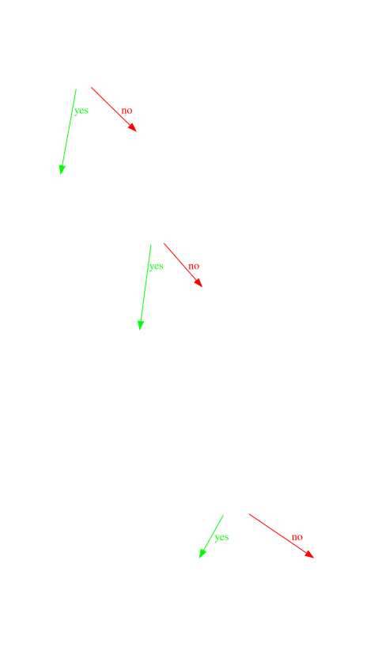

# Heap Memory Manager Simulation (hmm_sim)

A simulation of a heap memory manager that implements malloc and free functionality using a best-fit allocation algorithm. Now with thread-safe operations support.


## Features

- Custom implementation of memory allocation and deallocation
- Simulation of program break using a memory array
- Best-fit algorithm for efficient memory allocation
- Thread safety with mutex protection
- Comprehensive test suite including stress tests and multithreaded tests

## Project Structure
```sh
├── hmm_sim
│ ├── makefile
│ ├── README.md
│ ├── src
│ │ ├── hmm.c # Core implementation
│ │ ├── hmm.h # Header file
│ │ └── hmmMain.c # Main program
│ ├── tests
│ │ ├── test_hmm.c # Basic functionality tests
│ │ ├── test_stress.c # Stress testing
│ │ ├── test_multithread_basic.c # Basic multithreaded tests
│ │ └── testScript.sh # Test script
```
## Table of Contents

- [Features](#features)
- [Project Structure](#project-structure)
- [Functionality](#functionality)
  - [Memory Allocation](#memory-allocation)
  - [Memory Deallocation](#memory-deallocation)
  - [Thread-Safe Operations](#thread-safe-operations)
- [Testing](#testing)
- [Building and Running](#building-and-running)
- [Configuration](#configuration)

## Features

- **Dynamic Memory Allocation (`hmmAlloc`)**: 
  - Allocates memory blocks from a simulated heap of 100 MB.
  - Ensures alignment of allocated memory to a defined boundary (default is 8 bytes).
  - Uses a free list to manage memory blocks efficiently.

  

- **Memory Deallocation (`hmmFree`)**: 
  - Frees allocated memory blocks.
  - Supports coalescing of adjacent free blocks to minimize fragmentation.
  - Detects double frees and prevents memory corruption.

  

  **Best-fit algorithm**: Allocates the smallest available free block that is large enough to satisfy the request.

- **Program Break Management (`get_program_break`)**: Simulates the `sbrk(0)` system call, returning the current program break (end of the heap).

- **Heap State Printing (`print_heap_state`)**:
  - Provides a detailed view of the current state of the heap, including memory block sizes and allocation status.
  - Displays the current program break, which indicates the top of the heap.


## Functionality

### 1. Memory Allocation

- **Function**: `void* hmmAlloc(size_t size)`
- **Description**: Allocates a memory block of the specified size. If the size is zero, a default block size is allocated.
- **Returns**: Pointer to the allocated memory block, or `NULL` if allocation fails.

### 2. Memory Deallocation

- **Function**: `void hmmFree(void* ptr)`
- **Description**: Frees a previously allocated memory block. Handles double free errors and coalesces adjacent free blocks.
- **Parameters**: Pointer to the memory block to free.

### 3. Program Break Inspection

- **Function**: `void* get_program_break(void)`
- **Description**: Simulates the `sbrk(0)` system call, returning the current program break.

### 4. Heap State Printing

- **Function**: `void print_heap_state(void)`
- **Description**: Prints the current state of the heap, including details of each block.

### 5. Multithreaded Support

- **Function**: `void* hmmAlloc_mt(size_t size)`
- **Description**: Allocates a memory block of the specified size in a thread-safe manner.
- **Parameters**: Pointer to the memory block to free.


## Configuration

The heap memory manager can be configured through the following parameters in `hmm.h`:

- `MEMORY_SIZE`: Total size of the simulated heap (default: 100MB)
- `ALIGNMENT`: Memory alignment requirement (default: 8 bytes)


## Testing

The project includes several types of tests:

1. **Basic Tests** (`_test_hmm.c`)
   ```bash
   make testHmm
   ```
   Tests basic functionality including allocation, deallocation, and edge cases.

2. **Stress Tests** (`_test_stress.c`)
   ```bash
   make testStress
   ```
   Tests the heap manager under heavy load with random allocations and deallocations.

3. **Multithreaded Tests** (`_test_multithread_basic.c`)
   ```bash
   make testMtBasic
   ```
   Tests thread-safe operations with multiple threads performing concurrent allocations and deallocations.

## Building and Running

1. Build all targets:
   ```bash
   make
   ```

2. Run specific tests:
   ```bash
   make testHmm      # Run basic tests
   make testStress   # Run stress tests
   make testMtBasic  # Run multithreaded tests
   ```

3. Run the main program:
   ```bash
   make runMain
   ```

4. Clean build files:
   ```bash
   make clean
   ```


## Thread Safety

Thread safety is implemented using a mutex lock to protect critical sections during memory operations. When using the heap manager in a multithreaded environment:

- Use `hmmAlloc_mt()` instead of `hmmAlloc()`
- Use `hmmFree_mt()` instead of `hmmFree()`

These thread-safe versions ensure that memory operations are atomic and prevent race conditions.

## Limitations

- The total memory size is fixed at compile time
- Thread-safe operations may have slightly higher overhead due to mutex locking
- The simulated heap exists in process memory and does not persist between runs
